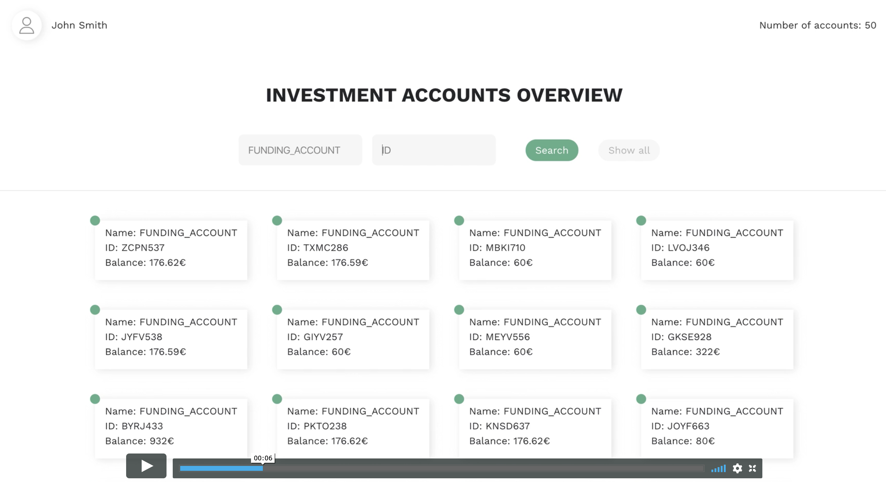

## Description:

#### Technologies and tools used:

- JavaSctipt
  - React
  - Jest testing framework
- HTML
- CSS
  - Sass
- Netlify

### App functionality overview:

- This app displays the data fetched from the provided API
- The app shows investment accounts overview of the user
- For a better navigation, there is a search fied
- The account can be found by Name and/or ID
- Button Show All gets back to all accounts

### Demo link

[Click to go to live demo]().

### Video demo:

## How get the app locally

- **`git clone https://github.com/AnyaSen/account-overview-page.git:`**

- **`npm install`**

### To run tests:

- `npm test`
